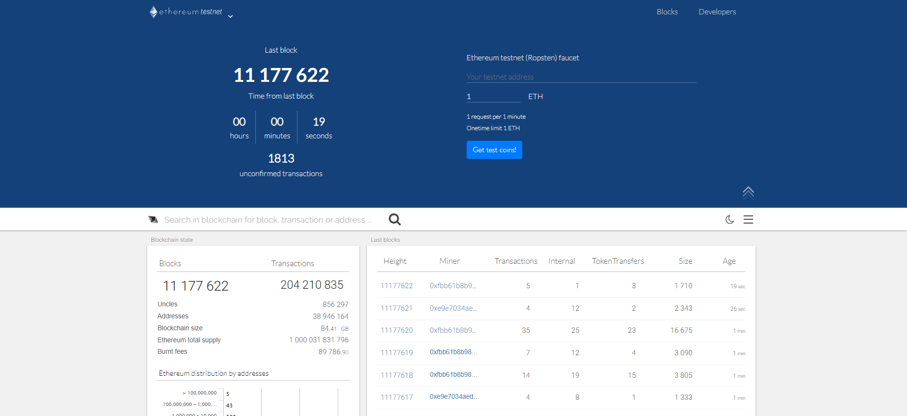

<h2 align="center"> Ethereum Blockchain </h2>

<p align="center">
  </a>
    
  </a>
  <a href="https://github.com/BrianMarquez3/Ethereum-Blockchain/stargazers">
    
  </a>
  <a href="https://github.com/BrianMarquez3/Ethereum-Blockchain/network">
    
  </a>
    
  </a>
  
  </a>
    
  </a>
  
  </a>
    
  </a>
  
   </a>
   <a href="https://github.com/BrianMarquez3/Ethereum-Blockchain/network">
    
  </a><br>
</p>
  
<table align="center">
  <tr>
    <td align="center" style="padding=0;width=50%;">
      
    </td>
  </tr>
</table>

## Introduction to Ethereum

- Ethereum Pagina Web [https://ethereum.org/](https://ethereum.org/en/)
- Ethereum Developers Resources [https://ethereum.org/en/developers](https://ethereum.org/en/developers/)
- Ethereum Development Documentation [https://ethereum.org/en/developers](https://ethereum.org/en/developers/)

## Comandos

Documentacion Website [web3py.readthedocs.io](https://web3py.readthedocs.io/en/stable/index.html)

_Instalar Web3_

```
pip install web3
```
 
_Actualizar PIP_

```
pip install --upgrade pip
```

## Ethereum Faucet

Acontinuacion presentamos algunos provedores de la red Ropsten Tesnet para ethereum:


<table align="center" >
  <tr>
    <td align="center" style="padding=0;width=50%;">
      
    </td>
  </tr>
</table>

- Link [https://teth.bitaps.com/](https://teth.bitaps.com/)

---

<table align="center" >
  <tr>
    <td align="center" style="padding=0;width=50%;">
      
    </td>
  </tr>
</table>

- Link [Ropsten Ethereum (rETH) Faucet](https://faucet.dimensions.network/)


<table align="center" >
  <tr>
    <td align="center" style="padding=0;width=50%;">
      
    </td>
  </tr>
</table>

## LICENSE

Use of this source code is governed by a MIT license that can be found in the LICENSE file.
